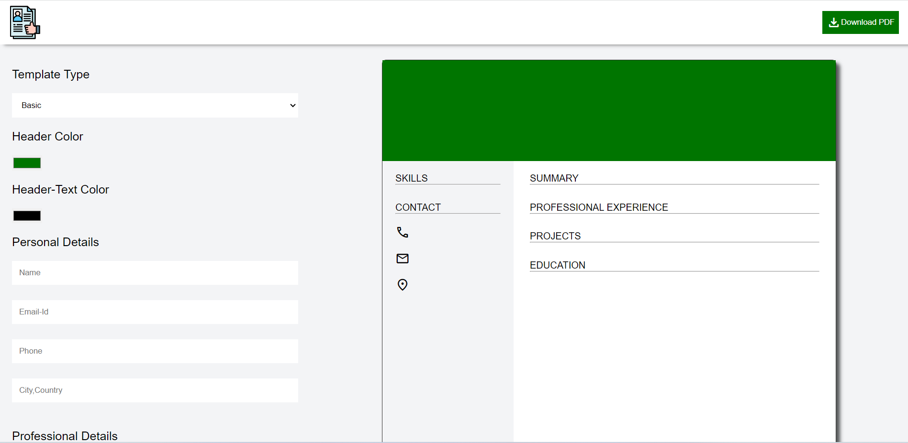
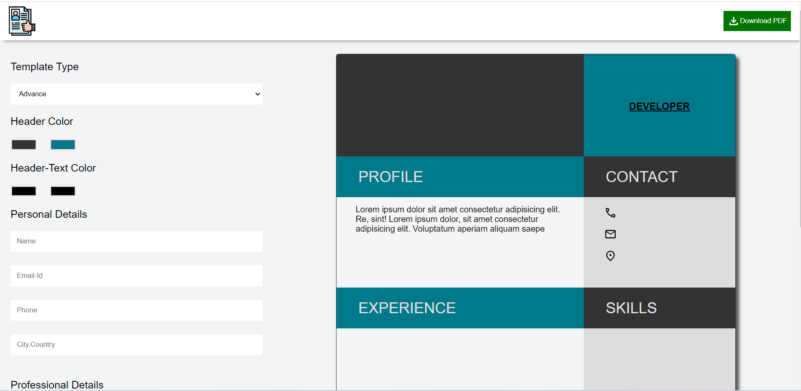

# Resume Builder Web App

Resume Builder is a web application that allows users to create and customize their resumes with ease. The app provides a user-friendly interface to input personal details, professional experiences, skills, and education information, generating a visually appealing and professional-looking resume.

## Table of Contents

- [Overview](#overview)
- [Screenshots](#screenshots)
- [Features](#features)
- [Usage](#usage)
- [Technologies Used](#technologies-used)

## Overview

In the modern job market, having a well-crafted resume is crucial. Resume Builder simplifies the process by offering a clean and intuitive platform for users to create personalized resumes. The application is designed to be responsive and user-friendly, making it accessible to a wide range of users.

## Screenshots

Include screenshots or links to screenshots of different pages or sections of your application.

](image.png))
![Second Page]](image-2.png)
![Third Page] ](image-4.png)

## Features

- **Page Navigation:** The app consists of three main pages - the initial page for choosing a template, a second page for entering resume details, and a third page for previewing and exporting the resume.
  
- **Template Choices:** Users can choose from different resume templates to suit their preferences.

- **Customization:** The application allows users to input personal details, professional experiences, skills, and education information.

- **Real-time Preview:** Users can preview their resume in real-time as they make changes.

## Usage

1. Open your web browser and go to `http://localhost:3000` (or the specified port).
2. Navigate through the pages:
   - **First Page:** Choose a template that suits your preferences.
   - **Second Page:** Input your personal details, professional experiences, skills, and education information.
   - **Third Page:** Preview your resume, make any necessary adjustments, and proceed to export or save the resume.

3. Customize the content:
   - Use the provided form fields to input your details.
   - For template-specific customization, follow any on-screen instructions.

4. Real-time Preview:
   - As you input information, the application provides a real-time preview of your resume.

5. Export or Save:
   - Once satisfied with your resume, use the provided options to export or save the resume in your preferred format.

6. Make any adjustments as needed:
   - Navigate back and forth between pages to refine your resume until it meets your requirements.

7. Enjoy using the Resume Builder!

## Technologies Used

- **Frontend:**
  - HTML5
  - CSS (with Flexbox and Grid for layout)
  - JavaScript (ES6+)

- **Styling:**
  - CSS-in-JS (Styled Components)

- **Build and Package Management:**
  - Node.js
  - npm (Node Package Manager)

- **Version Control:**
  - Git

- **Development Environment:**
  - Visual Studio Code or any preferred code editor

- **Responsive Design:**
  - Media queries for responsiveness on various devices

- **Version Control Hosting:**
  - GitHub

